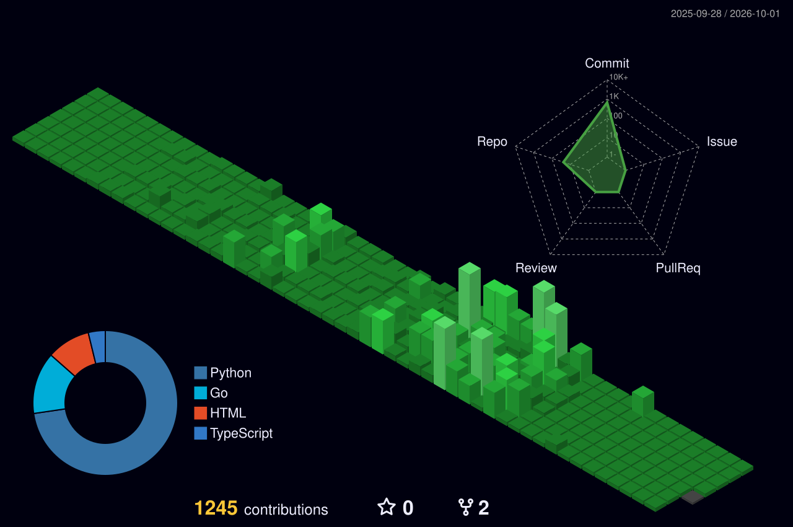

<!-- ═══════════════════════════════════════════════════════════ -->
<!--              ANIMATED GRADIENT HEADER BANNER               -->
<!-- ═══════════════════════════════════════════════════════════ -->

<!-- ═══════════════════════════════════════════════════════════ -->
<!--                    ANIMATED TYPING SVG                     -->
<!-- ═══════════════════════════════════════════════════════════ -->

 

<!-- ═══════════════════════════════════════════════════════════ -->
<!--                   CONTACT / SOCIAL LINKS                   -->
<!-- ═══════════════════════════════════════════════════════════ -->

&nbsp;&nbsp;
&nbsp;&nbsp;

  

&nbsp;&nbsp;

<!-- ═══════════════════════════════════════════════════════════ -->
<!--                       ABOUT ME                             -->
<!-- ═══════════════════════════════════════════════════════════ -->

### &nbsp; About Me

- **Role:** Project Engineer — DevOps & Platform Engineering
- **Org:** C-DAC, Pune (Centre for Development of Advanced Computing)
- **Focus:** CI/CD Pipelines · Kubernetes · Cloud Infrastructure · Observability

 

- :telescope: Building **[DevPlatform CLI](https://github.com/vedantchimote/DevPlatform-CLI)** — a Go CLI for multi-cloud IaC
- :seedling: Learning **AWS Solutions Architect** & **Advanced Kubernetes**
- :gear: Managing **12+ production VMs** for **3+ engineering teams**
- :zap: Reduced deployment time by **80%** with GitLab CI/CD pipelines
- :bar_chart: Achieving **<30 min MTTD** with Prometheus + Grafana + ELK
- :shield: Embedding **DevSecOps** (SonarQube, Trivy, OWASP ZAP) into CI/CD

 

<!-- ═══════════════════════════════════════════════════════════ -->
<!--                      TECH STACK                            -->
<!-- ═══════════════════════════════════════════════════════════ -->

<h3 align="center">Tech Stack</h3>

#### Cloud & Infrastructure

#### CI/CD & DevSecOps

#### Languages & Data

#### Tools

<!-- ═══════════════════════════════════════════════════════════ -->
<!--                    FEATURED PROJECTS                       -->
<!-- ═══════════════════════════════════════════════════════════ -->

<h3 align="center">Featured Projects</h3>

 

<table>
<tr>
<td width="50%" valign="top">
 
<h3 align="center"><a href="https://github.com/vedantchimote/DevPlatform-CLI">DevPlatform CLI</a></h3>

<b>Self-Service Internal Developer Platform</b>

 

Go CLI provisioning multi-cloud infra (AWS/Azure) via <b>Terraform</b> + <b>Helm</b>. Environment setup: <b>2 days → 5 min</b> (99% faster).

 

 
</td>
<td width="50%" valign="top">
 
<h3 align="center"><a href="https://github.com/vedantchimote/InfraGuard">InfraGuard</a></h3>

<b>AI-Powered Infrastructure Anomaly Detection</b>

 

Predicts infrastructure failures <b>60 min in advance</b> using <b>Isolation Forest</b> + <b>Facebook Prophet</b>. Auto-creates <b>Jira</b> tickets with severity mapping.

 

 
</td>
</tr>
</table>

<table>
<tr>
<td width="50%" valign="top">
 
<h3 align="center"><a href="https://github.com/vedantchimote/Cloudforge">CloudForge</a></h3>

<b>Cloud-Native 5-Microservice E-Commerce Platform</b>

 

<b>5 Spring Boot</b> microservices with <b>Kafka</b> event streaming, <b>ArgoCD</b> GitOps delivery on <b>Azure AKS</b>. Zero-downtime deployments with HPA + PDBs.

 

 
</td>
<td width="50%" valign="top">
 
<h3 align="center"><a href="https://github.com/vedantchimote/VMLedger">VMLedger</a></h3>

<b>Agentless CMDB & VM Observability Platform</b>

 

<b>Python/FastAPI</b> platform monitoring VMs via SSH. <b>60s</b> fleet-wide health checks with <b>Redis</b> caching, <b>Celery</b> tasks, and <b>Slack/Discord</b> alerting.

 

 
</td>
</tr>
</table>

<!-- ═══════════════════════════════════════════════════════════ -->
<!--                    GITHUB STATS                            -->
<!-- ═══════════════════════════════════════════════════════════ -->

<h3 align="center">GitHub Stats</h3>

  
  &nbsp;&nbsp;
  

 

 

<!-- ═══════════════════════════════════════════════════════════ -->
<!--                 3D CONTRIBUTION GRAPH                      -->
<!-- ═══════════════════════════════════════════════════════════ -->

<!-- ═══════════════════════════════════════════════════════════ -->
<!--                   ACTIVITY GRAPH                           -->
<!-- ═══════════════════════════════════════════════════════════ -->

<!-- ═══════════════════════════════════════════════════════════ -->
<!--                   SNAKE ANIMATION                          -->
<!-- ═══════════════════════════════════════════════════════════ -->

<!-- ═══════════════════════════════════════════════════════════ -->
<!--               WAKATIME DETAILED (COLLAPSED)                -->
<!-- ═══════════════════════════════════════════════════════════ -->

<b>:clock1: Wakatime Detailed Stats</b>

 

  

 

<!-- ═══════════════════════════════════════════════════════════ -->
<!--                      FOOTER                                -->
<!-- ═══════════════════════════════════════════════════════════ -->

