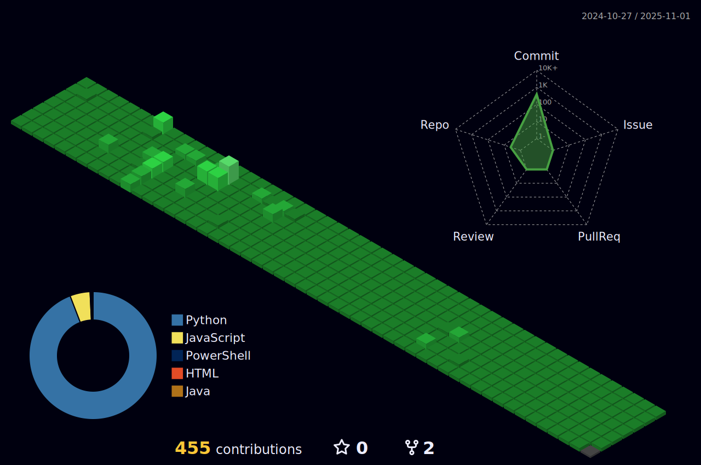
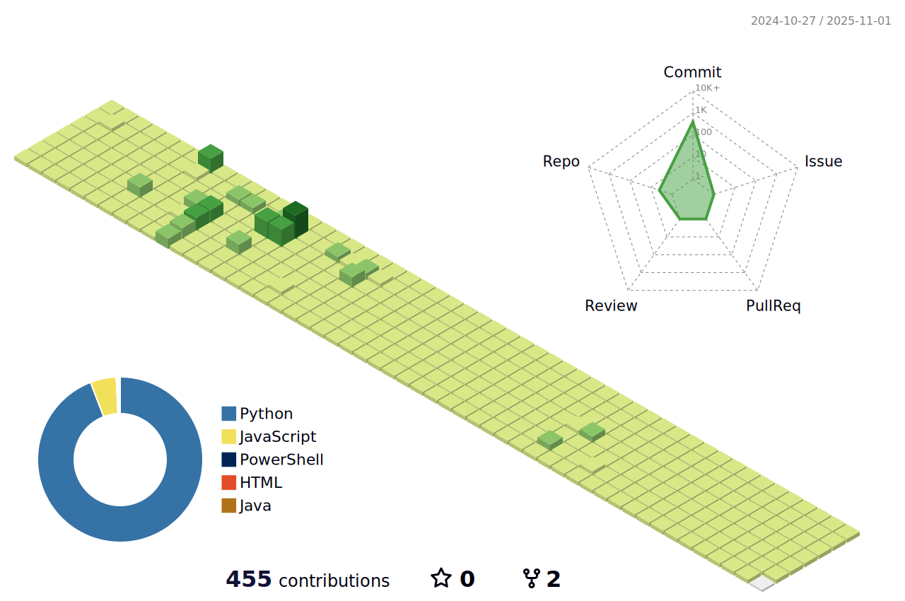

# Hey There :wave:, Welcome to my GitHub Profile👨‍💻

<a href="https://github.com/vedantchimote/vedantchimote">
  <picture>
    <source media="(prefers-color-scheme: dark)" srcset="https://raw.githubusercontent.com/vedantchimote/vedantchimote/main/dark_mode.svg">
    
  </picture>
</a>

## Skilled & Interested in:

### • Languages:

<code></code>
<code></code>
<code></code>
<code></code>

<!--<code></code>-->
<!--<code></code>-->

## Web Development (Full-stack):

### • Backend/Server:

<code></code>
<code></code>
<code></code>
<code></code>
<code></code>
<code></code>
<code></code>
<code></code>
<code></code>

<!--<code></code>-->
<!--<code></code>-->
<!--<code></code>-->

### • Micro-Services:

<code></code>
<code></code>
<code></code>
<code></code>

<!--<code></code>-->

### • Frontend/UI:

<code></code>
<code></code>
<code></code>
<code></code>
<code></code>
<code></code>

<!--<code></code>-->
<!--<code></code>-->

### • Database:

<code></code>
<code></code>

<!-- <code></code> -->
<!--<code></code> -->

### • Cloud/Dev-Ops:

<code></code>
<code></code>

<!--<code></code>-->
<!--<code></code>-->

### • Others:

<code></code>
<code></code>
<code></code>
 

# 📊 GitHub Stats:

<!--  --->
<!--

  

 -->

    
    
<!--     
     -->
  

